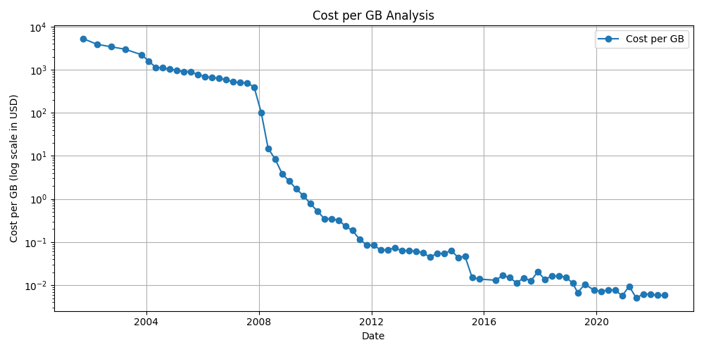
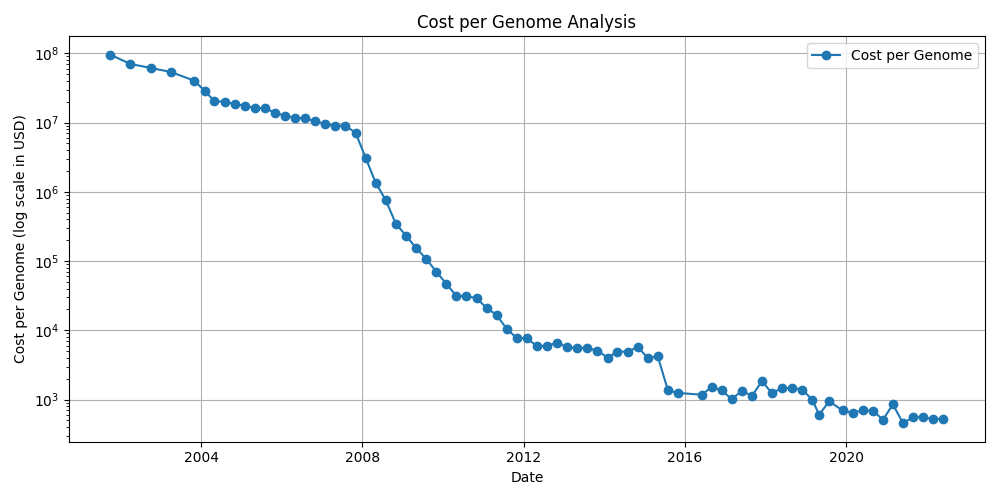
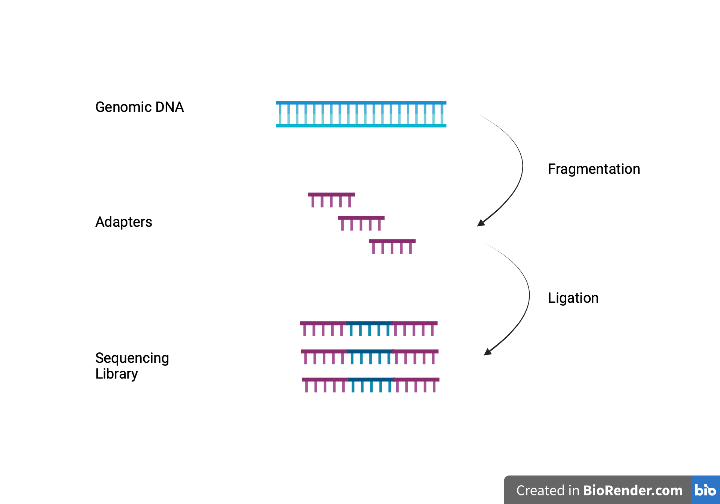
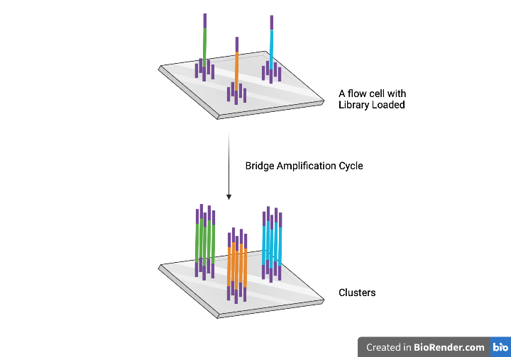
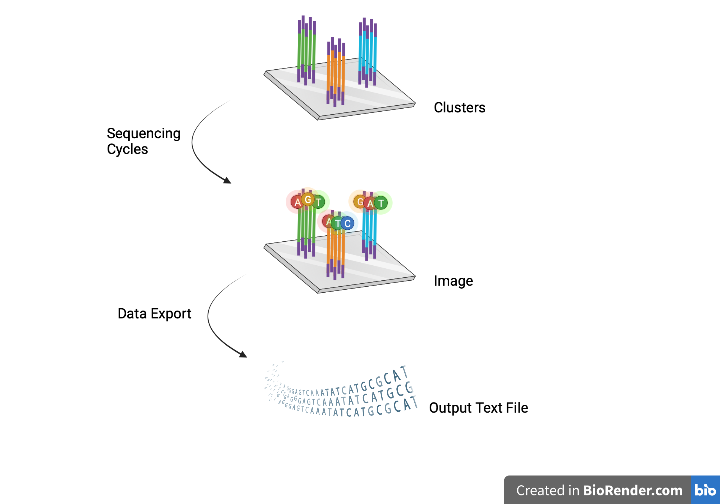
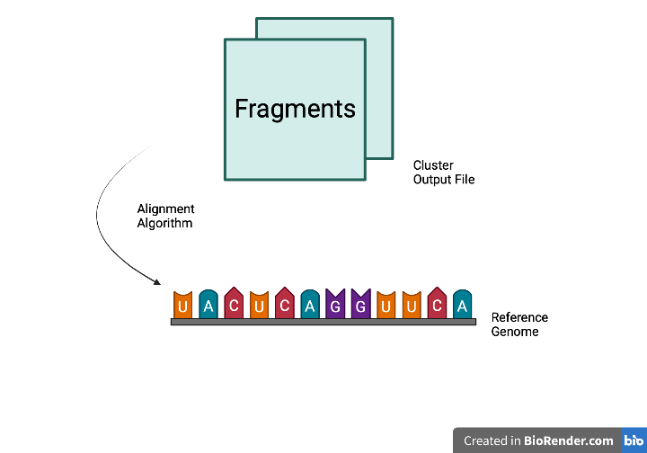

# A Brief Review of DNA Sequencing

## Abstract
This review presents a brief summary of the historical progression of DNA sequencing technology spanning 45 years. It also provides a succinct examination of contemporary methodologies and technologies employed in DNA sequencing, with particular emphasis on those utilized within the Illumina platform. Notably, the review sheds light on the forthcoming reinvigoration of competition in the field of DNA sequencing, which holds the potential to reignite the pace of technological advancements.

## Significance of DNA sequence
The arrangement of nucleic acids in polynucleotide chains carries the essential information governing the hereditary and biochemical characteristics of life on Earth[^3]. 

The clinical implementation of DNA sequencing, particularly whole exome sequencing (WES) and whole genome sequencing (WGS), has greatly improved the diagnostic potential for identifying potential Mendelian or other genetic disorders in patients. By sequencing the exome, which includes the protein-coding regions of the genome, healthcare providers can identify genetic variations linked to various diseases, thus facilitating precise and accurate diagnoses[^11].

Furthermore, DNA sequencing is significantly influencing clinical cancer care through various means. Firstly, it aids in suggesting targeted therapies by analyzing the specific mutations present in an individual's cancer. This personalized approach allows for more effective treatment strategies. Secondly, DNA sequencing enables non-invasive diagnosis or monitoring by examining circulating cells or cell-free DNA released by tumors. This method provides valuable information for assessing the progress of the disease and evaluating treatment responses. Lastly, sequencing helps identify cancer-specific mutations that alter proteins, potentially serving as neoantigens for personalized vaccine development. While success stories in these areas may currently be limited, considering the overall burden of cancer, notable progress is undoubtedly being made.[^2]

Given the significance of this sequence, scientists seek a cost-effective and time-efficient DNA sequencing technology to unravel its complexities[^1].

## Development of DNA sequence
In the 1950s, Fred Sanger pioneered the determination of the first protein sequence, specifically Insulin, using a somewhat cumbersome approach[^4][^5]. Over the following 70 years, scientists made significant advancements in DNA sequencing, scaling it up to the human genome and ultimately developing massively parallel DNA sequencing techniques[^2].

As a departure from electrophoretic sequencing, the rise of next-generation DNA sequencing (NGS) technology, also known as massively parallel sequencing, significantly supplanted the utilization of Sanger sequencing employed during the Human Genome Project[^6]. From 2007 to 2012, a number of platforms, including 454, Agencourt, Ion Torrent, and Solexa (later acquired by Illumina), fiercely competed in the NGS arena[^7]. This intense competition led to a remarkable reduction in the per-base cost of DNA sequencing by four orders of magnitude[^8].

| |
|:--:|
| <small>Figure 1: Sequencing Cost per GB since 2001</small> [^9]|

| |
|:--:|
| <small>Figure 2: Sequencing Cost per Genome since 2001</small> [^9]|

Since 2012, the progress in DNA sequencing technology has experienced a slowdown as Illumina has established dominance[^9]. With the advent of the Illumina NovaSeq instrument, a single graduate student can now generate over a billion independent reads, amounting to a terabase of sequence, in just two days, all at a cost of only a few hundreds dollars[^2][^10]. 

## Modern technology of DNA sequence
Illumina sequencing by synthesis (SBS) chemistry dominates the field, responsible for generating over 80 percent of the world's sequencing data. This technique offers exceptional precision and produces a substantial quantity of error-free reads[^12]. The Illumina Next-Generation Sequencing (NGS) workflows encompass four fundamental steps: Library Preparation, Cluster Generation, Sequencing and Data Analysis[^13]. 

| |
|:--:|
| <small>Figure 3: Library Preparation</small>[^13]|

| |
|:--:|
| <small>Figure 4: Cluster Generation</small>[^13]|

| |
|:--:|
| <small>Figure 5: Sequencing</small>[^13] |

| |
|:--:|
| <small>Figure 6: Data Analysis</small> [^13]|

## Future Development
After a period of almost ten years during which short reads from Illumina dominated DNA sequencing, PacBio has made substantial progress in the field. They have introduced the Onso system, an innovative benchtop platform for short-read DNA sequencing that delivers exceptional accuracy[^14]. Furthermore, PacBio has developed the Revio system, which enables high-throughput sequencing with long reads that exhibit a remarkable level of accuracy[^16]. These advancements are particularly significant given the apparent limitations in options for future discoveries using short reads[^17].

In order to address this competitive landscape, Illumina has undertaken strategic initiatives. They have made preparations for the introduction of novel products, encompassing an ultra-high-throughput production-scale instrument, alongside an advanced sequencing chemistry that surpasses the speed and accuracy of their existing kits[^10]. Notably, Illumina has unveiled their inaugural offering, enabling the concurrent sequencing of long and short reads on a singular instrument[^15].

Considering the rapid succession of these developments within a span of less than six months, it is plausible to anticipate that the year 2023 will witness a resurgence in the acceleration of DNA sequencing technology. The emergence of long-awaited competition in the industry after a prolonged period of relative stability suggests a renewed momentum and innovation in the field. As a result, the foreseeable future holds promising prospects for further advancements and breakthroughs in DNA sequencing technology.

## References

[^1]: Heather, James M., and Benjamin Chain. “The Sequence of Sequencers: The History of Sequencing DNA.” Genomics 107, no. 1 (January 2016): 1–8. https://doi.org/10.1016/j.ygeno.2015.11.003.

[^2]: Shendure, Jay, Shankar Balasubramanian, George M. Church, Walter Gilbert, Jane Rogers, Jeffery A. Schloss, and Robert H. Waterston. “DNA Sequencing at 40: Past, Present and Future.” Nature 550, no. 7676 (October 19, 2017): 345–53. https://doi.org/10.1038/nature24286.

[^3]: Sanger, Frederick. “SEQUENCES, SEQUENCES, AND SEQUENCES.” Annual Review of Biochemistry 57, no. 1 (June 1988): 1–29. https://doi.org/10.1146/annurev.bi.57.070188.000245.

[^4]: Sanger, F. “Chemistry of Insulin: Determination of the Structure of Insulin Opens the Way to Greater Understanding of Life Processes.” Science 129, no. 3359 (May 15, 1959): 1340–44. https://doi.org/10.1126/science.129.3359.1340.

[^5]: Sanger, Fred. “The Early Days of DNA Sequences.” Nature Medicine 7, no. 3 (March 2001): 267–68. https://doi.org/10.1038/85389.

[^6]: Behjati, Sam, and Patrick S. Tarpey. “What Is next Generation Sequencing?” Archives of Disease in Childhood - Education and Practice 98, no. 6 (December 1, 2013): 236–38. https://doi.org/10.1136/archdischild-2013-304340.

[^7]: Muir, Paul, Shantao Li, Shaoke Lou, Daifeng Wang, Daniel J. Spakowicz, Leonidas Salichos, Jing Zhang, et al. “The Real Cost of Sequencing: Scaling Computation to Keep Pace with Data Generation.” Genome Biology 17, no. 1 (March 23, 2016): 53. https://doi.org/10.1186/s13059-016-0917-0.

[^8]: Genome.gov. “DNA Sequencing Costs: Data,” September 14, 2022. https://www.genome.gov/about-genomics/fact-sheets/DNA-Sequencing-Costs-Data.

[^9]: Bronner, Iraad F., Michael A. Quail, Daniel J. Turner, and Harold Swerdlow. “Improved Protocols for Illumina Sequencing.” Current Protocols in Human Genetics 79, no. 1 (2013): 18.2.1-18.2.42. https://doi.org/10.1002/0471142905.hg1802s79.

[^10]: Eisenstein, Michael. “Illumina Faces Short-Read Rivals.” Nature Biotechnology 41, no. 1 (January 1, 2023): 3–5. https://doi.org/10.1038/s41587-022-01632-4.

[^11]: Nazeha, Nuraini, Ai Ling Koh, Sylvia Kam, Jiin Ying Lim, Denise Li Meng Goh, Saumya Shekhar Jamuar, and Nicholas Graves. “Reduced Resource Utilization with Early Use of Next-Generation Sequencing in Rare Genetic Diseases in an Asian Cohort.” American Journal of Medical Genetics Part A 188, no. 12 (2022): 3482–91. https://doi.org/10.1002/ajmg.a.62974.

[^12]: Bentley, David R., Shankar Balasubramanian, Harold P. Swerdlow, Geoffrey P. Smith, John Milton, Clive G. Brown, Kevin P. Hall, et al. “Accurate Whole Human Genome Sequencing Using Reversible Terminator Chemistry.” Nature 456, no. 7218 (November 2008): 53–59. https://doi.org/10.1038/nature07517.

[^13]: “An Introduction to Next-Generation Sequencing Technology,” n.d.

[^14]: PacBio. “Onso Sequencing System.” Accessed June 3, 2023. https://www.pacb.com/onso/.

[^15]: “Illumina Launches Its First Product Enabling Long- and Short-Read Sequencing on One Instrument.” Accessed June 3, 2023. https://investor.illumina.com/news/press-release-details/2023/Illumina-launches-its-first-product-enabling-long--and-short-read-sequencing-on-one-instrument/default.aspx.

[^16]: Sullivan, Michael. “HiFi Whole Genomes Could One Day Replace Short-Read Genome and Exome Sequencing.” PacBio, April 27, 2023. https://www.pacb.com/blog/medical-genomics/.

[^17]: Orellana, Luis H., Karen Krüger, Chandni Sidhu, and Rudolf Amann. “Comparing Genomes Recovered from Time-Series Metagenomes Using Long- and Short-Read Sequencing Technologies.” Microbiome 11, no. 1 (May 13, 2023): 105. https://doi.org/10.1186/s40168-023-01557-3.
