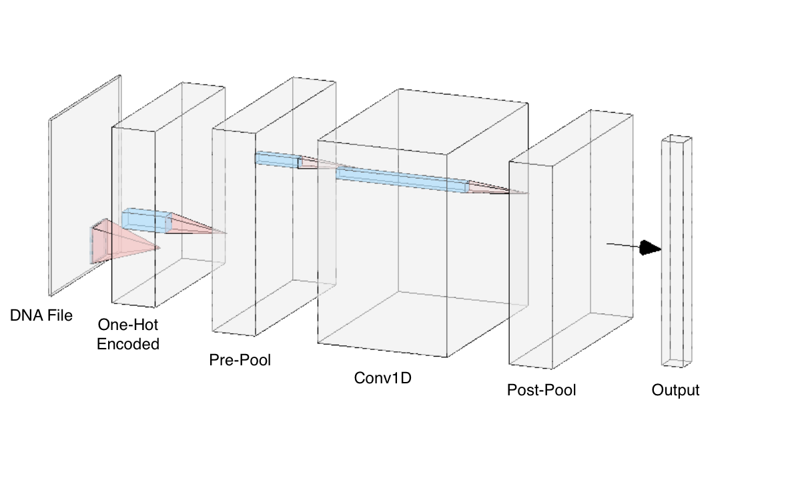
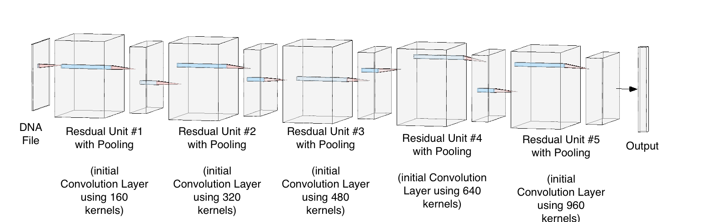
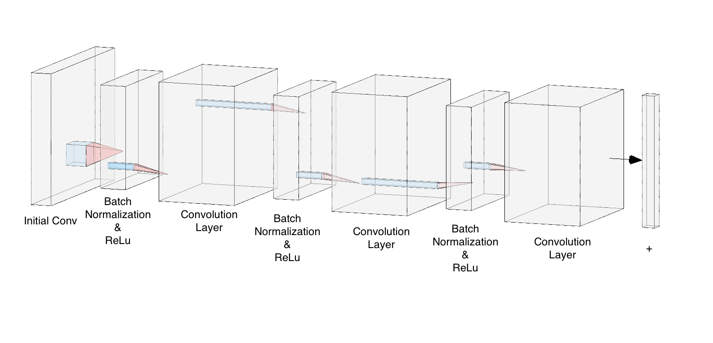
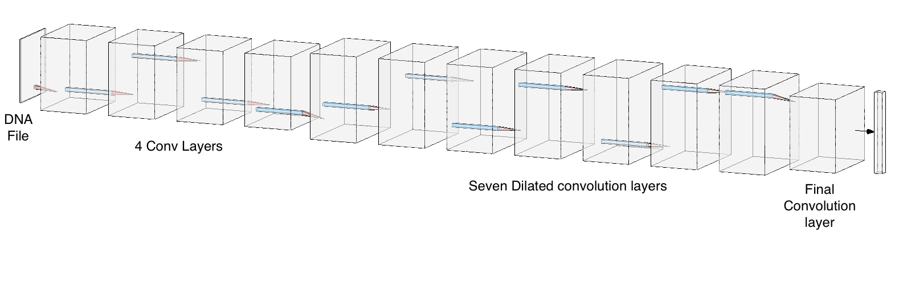
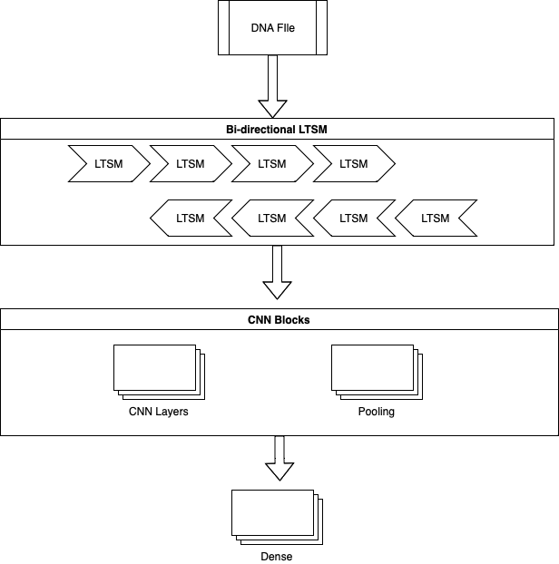
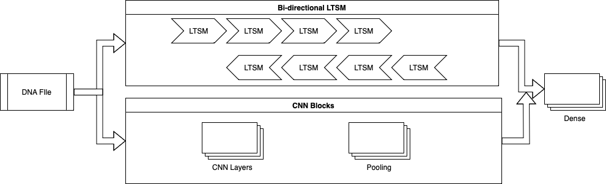
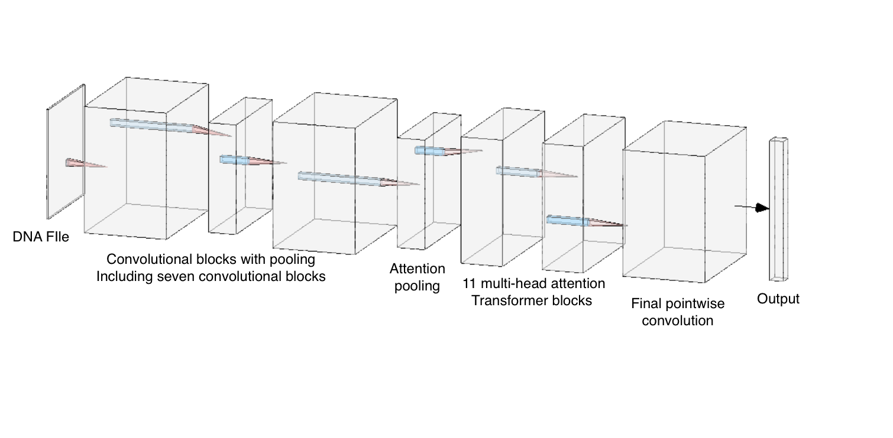

# A Brief Talk on Different DNNs in Regulatory Genomics

> In this talk, I will present a brief overview of popular deep learning models employed in the genetics field, focusing on their architecture. Furthermore, I will delve into the essential design principles that form the foundation of these models. It is crucial for a remarkable model to be intricately woven with the genetic problem it seeks to solve.

## Capture the Pattern within DNA sequences

Over the past few years, Deep Neural Networks (DNNs) have gained significant traction, and been used in various fields. Among the various types of DNN models, the Convolutional Neural Network (CNN) has emerged as a dominant and extensively employed approach. Their exceptional capability stems from their distinctive capacity to extract hierarchical representations from input data, achieved through the utilization of convolutional operations and the learning of feature hierarchies[^1].

In the field of genetics, CNNs have proven valuable for detecting specific motifs or patterns within DNA sequences.[^3] They can be specifically designed to identify crucial elements like transcription factor binding sites, promoter regions, or functional segments.[^4] Through training on labeled genomic data, CNNs can effectively learn to recognize and classify these patterns, facilitating genome annotation and enhancing our understanding of the functional elements encoded in DNA.[^5]

The simplest design of a CNN model typically follows the following architecture:

- **Input Layer**: The initial input is a DNA sequence. 

- **One-hot Encoding Layer**: The DNA sequence is transformed into a machine-readable format using a technique known as one-hot encoding. This process involves converting the four bases (Adenine (A), Thymine (T), Guanine (G), Cytosine (C)) of the DNA sequence into binary vectors. This transformation is crucial as it allows the model to handle the DNA sequence numerically.

- **Pooling Layer (Pre-CNN)**: Prior to the CNN layers, a pooling layer is employed. The objective of this layer is to down-sample the one-hot encoded input features. This helps to prevent overfitting by providing an abstracted form of the representation.

- **Convolutional Layers**: The core of the model lies in the CNN layers, which act to extract features from the processed DNA sequences. CNN uses a filter or a kernel that slides over the input data and performs convolution operations, effectively capturing patterns and features within the DNA sequences that might be critical for genetic analysis.

- **Pooling Layer (Post-CNN)**: After the CNN layers, another pooling layer is incorporated. This layer helps in further reducing the dimensionality of the extracted features, focusing on the most important information. 

| |
|:--:|
| <small>Figure 1: Architecture of DeepBind</small>|

DeepBind was created to tackle the challenge of deciphering the sequence specificities of DNA- and RNA-binding proteins.[^6] Through the use of convolutional neural networks (CNNs), DeepBind exhibits an impressive capability to detect and comprehend the localized patterns and interdependencies found within biological sequences.  sequences.

## Capture More Complex Features
The utilization of a single-layer CNN in analysis encounters certain limitations. These models face challenges in comprehending the intricate nature and hierarchical structure of complex data, leading to potential oversights of high-level features and long-range dependencies within the sequences.[^7] Similar challenges are expected to arise in the field of Regulatory Genomics.

To address these limitations, the incorporation of multiple layers into the CNN architecture is highly beneficial. By integrating multiple layers, the network gains the capability to acquire hierarchical representations, thereby facilitating the effective capture of both local and global context within the genetic sequences.[^8] This multi-layer approach significantly enhances the model's ability to comprehend the intricate relationships and intricate patterns that are inherent in the data, aligning well with the complex nature of DNA sequences.

A typical multi-layer CNN follows a similar structure to the simplest CNN, with the key difference being the stacking of multiple CNN layers. Each layer in the multi-layer CNN performs convolutional operations, extracting local patterns and features from the DNA file. 

| |
|:--:|
| <small>Figure 2: Architecture of DeepSEA</small>|

The problem that scientists want to solve with DeepSEA is the identification and prediction of the functional effects of noncoding variants in the genome.[^9] DeepSEA surpasses DeepBind by directly predicting the functional effects of noncoding variants based on genomic sequence. It offers single-nucleotide sensitivity in predicting various chromatin features. The multi-layer structure in DeepSEA allows the model to capture sequence dependencies at multiple spatial scales. By integrating sequence information from a wide sequence context, DeepSEA considers the surrounding DNA sequence of the variant position, which is crucial for understanding its functional effects.

## Add-ons for CNN
Expanding upon the foundation of the simple CNN model, the integration of additional add-on layers offers an opportunity to augment the performance and capabilities of genetic analysis. These supplementary layers, such as Transformers, Residual CNNs, Dilated Residual or Dilated CNNs, attention mechanisms, and Graph Convolutional Networks (GCNs), introduce advanced techniques that extend the model's capacity to capture intricate genetic patterns, long-range dependencies, multi-scale features, and structural relationships. By incorporating these add-on layers, the simple CNN model evolves into a more potent and versatile framework, empowering researchers to delve deeper into the complexities of genetic problems and achieve improved accuracy and efficiency in their analyses.

### Residual CNNs
Residual CNNs, also known as ResNets, were introduced to address the problem of vanishing gradients and facilitate the training of deep networks. In genetics, where the DNA sequences can be extremely long and contain subtle patterns, deep networks can be beneficial. By adding residual connections, which bypass certain convolutional layers, the gradients can flow more easily, enabling better propagation of information throughout the network. This can result in improved feature extraction and better modeling of complex genetic relationships.

| |
|:--:|
| <small>Figure 3: Architecture of ExpResNet</small>|

| |
|:--:|
| <small>Figure 4: Detail of Residual Module</small>|

### Dilated CNNs
Dilated CNNs, also known as atrous convolution, introduce dilation rates to the convolutional layers. This technique allows the receptive field of the network to grow exponentially without increasing the number of parameters or spatial dimensions. Dilated CNNs have shown promising results in various image analysis tasks, and their application in genetics can be advantageous as well. By using dilated convolutions, the model can capture multi-scale features present in the DNA sequence, which is essential when analyzing genetic data with varying levels of resolution. Combining dilated convolutions with residual connections further enhances the model's capacity to extract meaningful features at different scales.

| |
|:--:|
| <small>Figure 5: Architecture of Basenji</small>|

## Treat as Sequential Data
While convolutional neural networks (CNNs) excel at capturing local features in data, they have limitations in learning hidden relationships within sequential data. In contrast, recurrent neural networks (RNNs) and their variants are more powerful tools for processing sequential data. The design of RNNs allows them to capture the time dependencies in data by maintaining an internal state and passing it as input to the next time step.

### LTSM
However, traditional RNNs encounter the vanishing or exploding gradient problem when dealing with long sequences, which makes it challenging to capture long-range dependencies. To overcome this issue, variants such as long short-term memory networks (LSTMs) has been introduced. These network structures incorporate gating mechanisms that effectively control the flow of information, allowing for the capture of long-term dependencies.

| |
|:--:|
| <small>Figure 6: Architecture of DeepSite</small>|

Nevertheless, the straightforward approach of stacking CNN and LSTM networks lacks optimization as it fails to fully exploit the strengths inherent in each architecture. To address this limitation, a more enhanced method is proposed in this model. Instead of sequential stacking, the proposed method involves running these two units in parallel, utilizing encoded DNA as the input for both architectures.

| |
|:--:|
| <small>Figure 7: Architecture of Deep6mAPred</small>|

### Transformer

In addition to RNNs and their variants, there is a powerful model for handling sequential data called the Transformer. The Transformer is based on self-attention mechanisms, which enable it to establish global dependencies within the sequence. By dynamically attending to different positions in the sequence, the Transformer can efficiently interact and integrate information. This mechanism allows the Transformer to handle longer sequences while maintaining lower computational complexity.

Unlike traditional CNNs that rely on convolutional filters, Transformers utilize a self-attention mechanism to capture dependencies and relationships between DNA sequence elements. This allows the model to effectively learn long-range dependencies, which can be crucial in genetic analysis, where distant regions of DNA may interact or have functional significance. By incorporating Transformer layers into the CNN model, we can potentially improve the model's ability to capture complex genetic patterns and interactions.

| |
|:--:|
| <small>Figure 8: Architecture of Enformer</small>|

[^1]: Kelley, David R., Jasper Snoek, and John L. Rinn. “Basset: Learning the Regulatory Code of the Accessible Genome with Deep Convolutional Neural Networks.” Genome Research 26, no. 7 (July 2016): 990–99. https://doi.org/10.1101/gr.200535.115.

[^2]: Alzubaidi, Laith, Jinglan Zhang, Amjad J. Humaidi, Ayad Al-Dujaili, Ye Duan, Omran Al-Shamma, J. Santamaría, Mohammed A. Fadhel, Muthana Al-Amidie, and Laith Farhan. “Review of Deep Learning: Concepts, CNN Architectures, Challenges, Applications, Future Directions.” Journal of Big Data 8, no. 1 (March 31, 2021): 53. https://doi.org/10.1186/s40537-021-00444-8.

[^3]: Wu, Di, Deepti S. Karhade, Malvika Pillai, Min-Zhi Jiang, Le Huang, Gang Li, Hunyong Cho, Jeff Roach, Yun Li, and Kimon Divaris. “Machine Learning and Deep Learning in Genetics and Genomics.” In Machine Learning in Dentistry, edited by Ching-Chang Ko, Dinggang Shen, and Li Wang, 163–81. Cham: Springer International Publishing, 2021. https://doi.org/10.1007/978-3-030-71881-7_13.

[^4]: Alipanahi, Babak, Andrew Delong, Matthew T. Weirauch, and Brendan J. Frey. “Predicting the Sequence Specificities of DNA- and RNA-Binding Proteins by Deep Learning.” Nature Biotechnology 33, no. 8 (August 2015): 831–38. https://doi.org/10.1038/nbt.3300.

[^5]: Hu, Xuehai, Alisdair R Fernie, and Jianbing Yan. “Deep Learning in Regulatory Genomics: From Identification to Design.” Current Opinion in Biotechnology 79 (February 1, 2023): 102887. https://doi.org/10.1016/j.copbio.2022.102887.

[^6]: Alipanahi, Babak, Andrew Delong, Matthew T. Weirauch, and Brendan J. Frey. “Predicting the Sequence Specificities of DNA- and RNA-Binding Proteins by Deep Learning.” Nature Biotechnology 33, no. 8 (August 2015): 831–38. https://doi.org/10.1038/nbt.3300.

[^7]: Yu, Wei, Kuiyuan Yang, Hongxun Yao, Xiaoshuai Sun, and Pengfei Xu. “Exploiting the Complementary Strengths of Multi-Layer CNN Features for Image Retrieval.” Neurocomputing 237 (May 10, 2017): 235–41. https://doi.org/10.1016/j.neucom.2016.12.002.

[^8]: Kulkarni, Praveen, Joaquin Zepeda, Frederic Jurie, Patrick Perez, and Louis Chevallier. “Hybrid Multi-Layer Deep CNN/Aggregator Feature for Image Classification.” In 2015 IEEE International Conference on Acoustics, Speech and Signal Processing (ICASSP), 1379–83, 2015. https://doi.org/10.1109/ICASSP.2015.7178196.

[^9]: Zhou, Jian, and Olga G. Troyanskaya. “Predicting Effects of Noncoding Variants with Deep Learning–Based Sequence Model.” Nature Methods 12, no. 10 (October 2015): 931–34. https://doi.org/10.1038/nmeth.3547.
