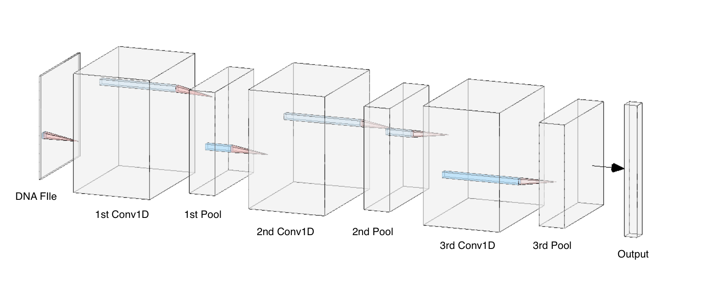

# A Brief Talk on Different DNNs in Regulatory Genomics

## Abastract

In this article, my objective is to compare various well-known deep-learning models utilized in the field of genetics. Additionally, I will elucidate the fundamental design principles behind these models, focusing on their ability to address specific problems.

## Simple CNN models

Convolutional Neural Networks (CNNs) are a type of deep learning model widely employed in image recognition and analysis tasks. Their strength lies in their ability to extract hierarchical representations from input data using convolutional operations and learning feature hierarchies.

In the field of genetics, CNNs have proven valuable for detecting specific motifs or patterns within DNA sequences. They can be specifically designed to identify crucial elements like transcription factor binding sites, promoter regions, or functional segments. Through training on labeled genomic data, CNNs can effectively learn to recognize and classify these patterns, facilitating genome annotation and enhancing our understanding of the functional elements encoded in DNA.

A simple Convolutional Neural Network (CNN) model, applied to problems in the field of genetics, typically possesses the following architecture:

- **Input Layer**: The initial input is a DNA sequence. DNA, being the blueprint of life, carries genetic information that can be used for various purposes in genetics and computational biology.

- **One-hot Encoding Layer**: The DNA sequence is transformed into a machine-readable format using a technique known as one-hot encoding. This process involves converting the four bases (Adenine (A), Thymine (T), Guanine (G), Cytosine (C)) of the DNA sequence into binary vectors. This transformation is crucial as it allows the model to handle the DNA sequence numerically.

- **Pooling Layer (Pre-CNN)**: Prior to the CNN layers, a pooling layer is employed. The objective of this layer is to down-sample the one-hot encoded input features, thereby reducing the spatial dimensions (height and width), and consequently, the computational complexity. This helps to prevent overfitting by providing an abstracted form of the representation.

- **Convolutional Layers**: The core of the model lies in the CNN layers, which act to extract features from the processed DNA sequences. CNN uses a filter or a kernel that slides over the input data and performs convolution operations, effectively capturing patterns and features within the DNA sequences that might be critical for genetic analysis.

- **Pooling Layer (Post-CNN)**: After the CNN layers, another pooling layer is incorporated. This layer helps in further reducing the dimensionality of the extracted features, focusing on the most important information. By doing this, the model becomes more robust to variations and reduces the risk of overfitting.

| |
|:--:|
| <small>Figure 1: Architecture of DeepBind</small>|

| |
|:--:|
| <small>Figure 2: Architecture of DeepSEA</small>|

## Add-ons for CNN
Expanding upon the foundation of the simple CNN model, the integration of additional add-on layers offers an opportunity to augment the performance and capabilities of genetic analysis. These supplementary layers, such as Transformers, Residual CNNs, Dilated Residual or Dilated CNNs, attention mechanisms, and Graph Convolutional Networks (GCNs), introduce advanced techniques that extend the model's capacity to capture intricate genetic patterns, long-range dependencies, multi-scale features, and structural relationships. By incorporating these add-on layers, the simple CNN model evolves into a more potent and versatile framework, empowering researchers to delve deeper into the complexities of genetic problems and achieve improved accuracy and efficiency in their analyses.

### Transformers
Transformers have gained significant attention in natural language processing tasks, but their potential in genetics is also worth exploring. Unlike traditional CNNs that rely on convolutional filters, Transformers utilize a self-attention mechanism to capture dependencies and relationships between DNA sequence elements. This allows the model to effectively learn long-range dependencies, which can be crucial in genetic analysis, where distant regions of DNA may interact or have functional significance. By incorporating Transformer layers into the CNN model, we can potentially improve the model's ability to capture complex genetic patterns and interactions.
| |
|:--:|
| <small>Figure 3: Architecture of Enformer</small>|

### 

[^1]: Kelley, David R., Jasper Snoek, and John L. Rinn. “Basset: Learning the Regulatory Code of the Accessible Genome with Deep Convolutional Neural Networks.” Genome Research 26, no. 7 (July 2016): 990–99. https://doi.org/10.1101/gr.200535.115.
